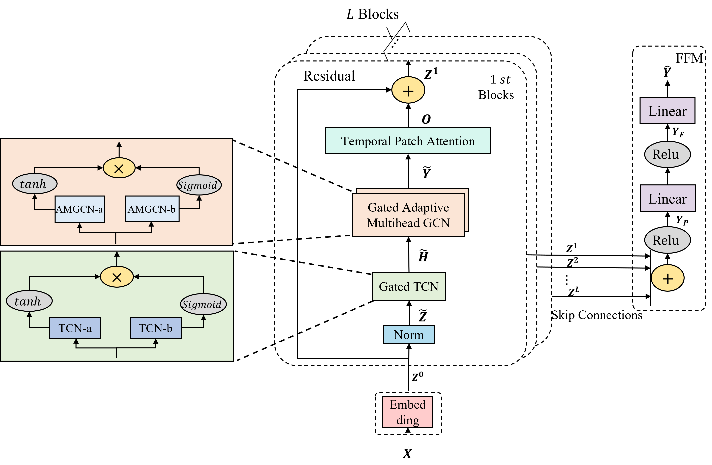
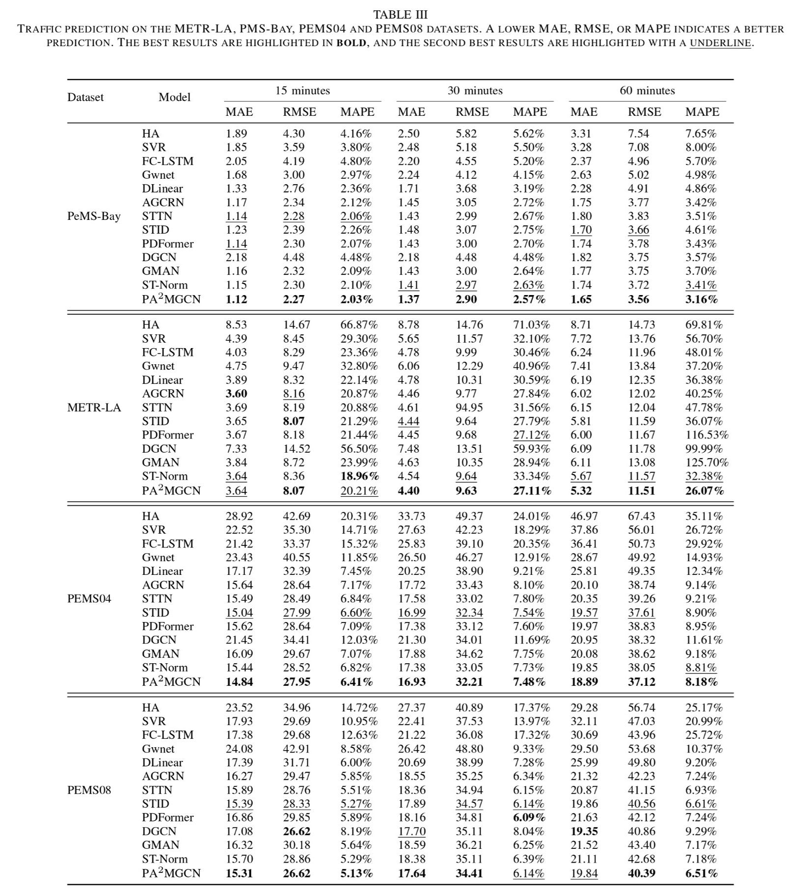

# $\text{PA}^2\text{MGCN}$

>  $\text{PA}^2\text{MGCN}$ consists of an Embedding layer, $L$ spatial-temporal blocks sequentially connected, and an FFN.  A spatial-temporal block is constructed by a Norm Layer, a gated temporal convolution (a Gated TCN module) which consists of two parallel temporal convolution layers (TCN-a and TCN-b), a gated adaptive graph convolution (Gated Adaptive Multi-Head GCN Module) which also consists of two parallel adaptive graph convolution layers(Adaptive Multi-Head GCN-a and Adaptive Multi-Head GCN-b) and a Patch Temporal Attention Module. A FFN is a FeedForward network constructed by two FC($\cdot$).                


# Overview

	

<center><p>Figure1.The overall architecture</p></center>				


## Main Results




## Data Preparation

The Los Angeles traffic speed files (METR-LA) and the Bay Area traffic speed files (PEMS-BAY), as well as the Los Angeles traffic flow files (PEMS04 and PEMS08), can be accessed and downloaded from [Baidu Yun](https://pan.baidu.com/s/1ShuACUFZGR0EnEkIoYSw-A?pwd=ib60). Please place these files in the `datasets/` folder.


## Get Started

We have provided all the experimental scripts for the benchmarks in the `./scripts` folder, which cover all the benchmarking experiments. To reproduce the results, you can run the following shell code.

```python
   ./scripts/train.sh
```